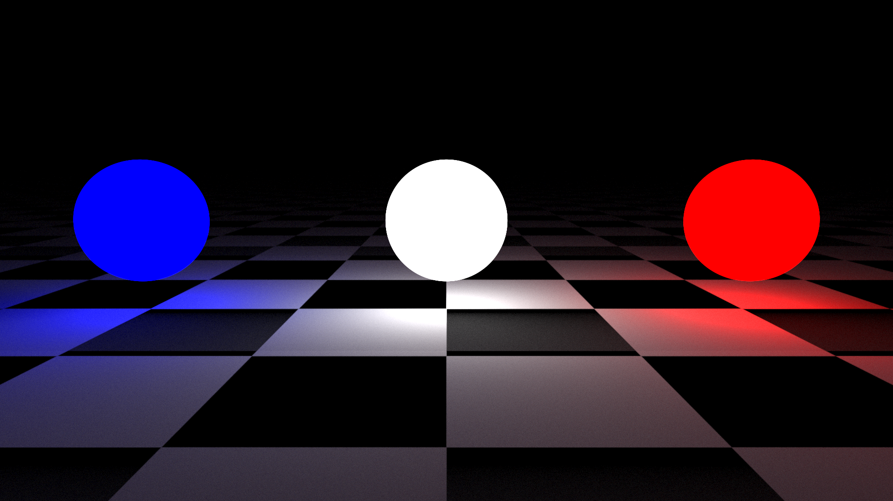
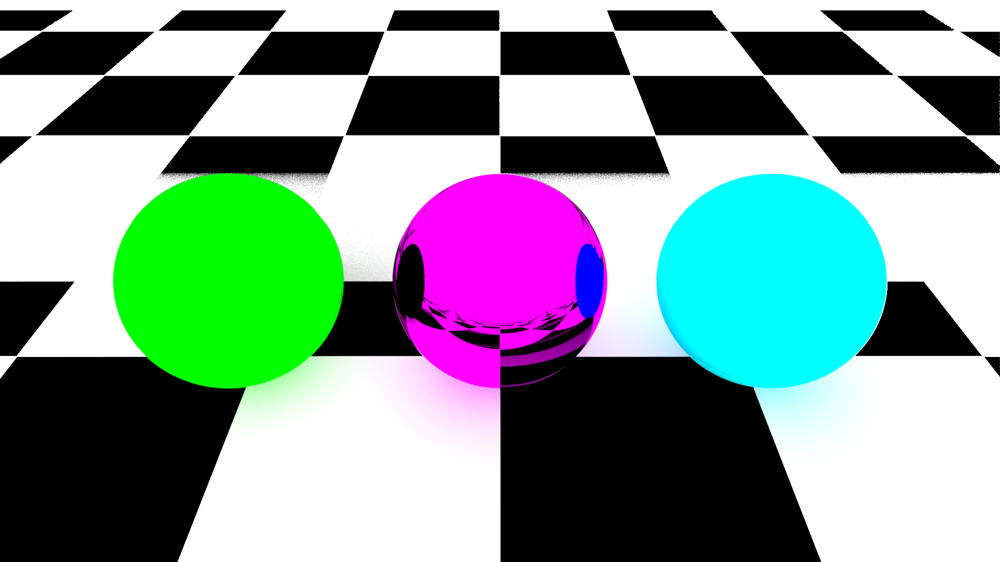
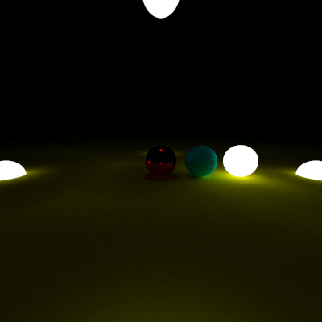
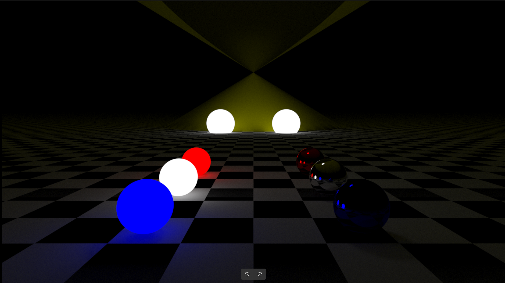

# RayTracer Project



## Table of Contents
- [Launching the Program](#launching-the-program)
- [Adding Primitives and Materials](#adding-primitives-and-materials)
- [Configuring Scene Files](#configuring-scene-files)
- [GUI Usage](#gui-usage)
- [Render Examples (Screenshots)](#render-examples-screenshots)
- [Conclusion](#conclusion)
- [Disclaimer](#disclaimer)

## Launching the Program
To launch our RayTracer, follow these preliminary commands from the root directory of the repository:

```sh
make fclean
make
```

After compilation, run the program with the following command:

```sh
./raytracer [options] > [output_image_path]
```

### Options
- `-h` or `--help`: Display the help menu
- `-s` or `--scene [configuration_file_path]`: Specify the target configuration file (required)
- `-t` or `--threads [number_of_threads]`: Specify the number of threads for rendering (default is 1)
- `-g` or `--gui`: Launch the program with a graphical interface
- `-q` or `--quality [number_of_samples]`: Specify the number of samples to adjust image quality (default is 100)

> **Note:** If the program is launched with the graphical interface (`-g` or `--gui`), you do not need to specify an output path.

## Adding Primitives and Materials
### Adding a Primitive
To add a new primitive (a shape to be rendered), follow these steps:

1. **Create a Directory for Source Files and Makefile:**
   - Create a folder for the primitive in `/plugins/primitives/[primitive_name]/`.
   - Inside this folder, create two subfolders: `includes/` and `src/`.

2. **Source Files:**
   - Place the header file `[primitive_name].hpp` in the `includes/` directory.
   - Place the source file `[primitive_name].cpp` in the `src/` directory.

3. **Makefile:**
   - Create a Makefile in `/plugins/primitives/[primitive_name]/` to compile the source files into a shared object file named `raytracer_[primitive_name].so`.

4. **Update the Main Makefile:**
   - In `/plugins/primitives/Makefile`, add:
     - `make -C [primitive_name]` under the `all` instruction.
     - `make clean -C [primitive_name]` under the `clean` instruction.
     - `make fclean -C [primitive_name]` under the `fclean` instruction.

5. **Implement the Primitive Class:**
   - Create a class for the primitive in the `RayTracer` namespace that inherits from the abstract class `AShape`.
   - Define necessary properties and methods, including collision detection and transformation handling.

6. **Library Functions:**
   - Implement `initShape()` to return an instance of the primitive.
   - Implement `getType()` to return the primitive's unique identifier.

   > Take example from other's shapes, you will need to implement your own `hit()` function

7. **External File Updates:**
   - Add the primitive to the `LIBRARY_TYPE` enum in `/includes/Core.hpp`.
   - Update the `getPrimitiveConfig()` function in `/src/Parser.cpp` to handle the new primitive's properties.

## Configuring Scene Files
Each scene is described in a configuration file with the `.scene` extension, stored in the `scenes/` directory. The configuration file includes settings for the camera, materials, primitives, and transformations.

### Camera Configuration
Specify the following parameters for the camera:
- `resolution` (mandatory)
- `position` (mandatory)
- `fov` (optional, default: 45°)
- `max_depth` (optional, default: 50)
- `focus_point` (optional, default: (0, 2, 0))
- `background_color` (optional, default: (0, 0, 0))
- `samples` (optional, default: 100)

### Primitives
Declare primitives in the `primitives` section:
- `name`: Primitive name
- `type`: Corresponding number returned by `getType()`
- `material`: Material name defined in the `materials` section
- Additional properties specific to the primitive

### Material
Define materials in the `materials` section of the configuration file:
- `name`: Material name
- `type`: Material type (`lambertian`, `metal`, `lightDiffuse`, `chessBoard`)
- `color`: Color in RGB format (or `color1` and `color2` for `chessBoard`)
- `fuzziness`: For `metal` type only

> You can take example from our scenes in the ./scenes folder

### Transformations
Define transformations in the `transformations` section:
- `name`: Primitive name
- `type`: `rotate` or `translate`
- `vector`: Transformation vector

> **Note:** Modifying the configuration file during execution will automatically update the scene rendering.

## GUI Usage
To launch the program with a graphical user interface, use the `-g` or `--gui` option. This mode provides an interactive way to visualize and modify the scene in real-time without manually editing configuration files.

## Render Examples (Screenshots)
Here are some examples of images rendered using our RayTracer:





## Disclaimer
This project was developed for our second year at EPITECH.

EPITECH students are advised not to use this code. Any attempt to submit this code for your RayTracer project is strictly prohibited and will be considered cheating (-42)

You can take inspiration from the concepts used in this project but do not reuse our code.
